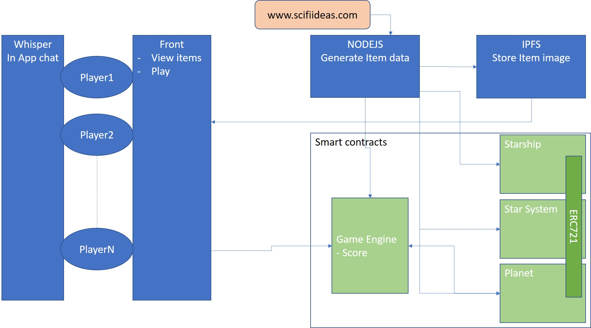

# decentralized_game
A game for mid-term exam of The School.ai

## Rules of the game

Every gamers start from Earth and need to buy SpaceShip to explore other system.
Or buy a Planet who has already been discovered.
Ppl who own an entire system get improvement. For example could build SpaceShip for others.
Spaceship disapeer if you want to colonize a planet. So if you discover one you could sell it as is or colonize it to sell his ressources.
Once you own a planet you could buy improvement from others planets.
Spaceship could buy ressources from Planet and sell them to other planets.
Every item could be sold to others player.

## Technical architecture

Planets and Spaceship are ERC721 tokens so it could be bougth and sold with ETH.

We use Truffle as a the main framework. Ganache-cli as test blockchain.




### Generating planets and spaceship

To create the planets and spaceship we do :
- Scrapping of http://www.scifiideas.com/spaceship-name-generator/ and store it in a JSON
- Iterate the JSON and loading it into our contracts with "truffle exec tools/load_planet_to_contract.js"
- Scrapping of Google image using googleimagesdownload -k "spaceship colonization" (https://github.com/hardikvasa/google-images-download )
- Resize and crop of the picture to 256x256 using ImageMagick in a Python script tools/resize_and_crop.py
- We upload them to IPFS using NodeJS
- Finally we feed these datas in the contracts with NodeJS

### Dependencies

```
"dependencies": {
  "cheerio": "^1.0.0-rc.2",    => For scrapping
  "lite-server": "^2.3.0",     => For easy testing of the front
  "request": "^2.85.0",        => For scrapping
  "request-promise": "^4.2.2", => For scrapping
  "zeppelin-solidity": "1.8.0" => For smart contract models, but we don't use it finally.
}
```

## Project tree

```
├── bs-config.json => Config for the webserver
├── build
│   └── contracts  => JSON metadata of the contracts, used to call it in JS
│       ├── ERC721Planet.json
│       ├── ERC721SpaceShip.json
│       ├── Migrations.json
│       └── SimpleERC721.json
├── contracts => Sources of the contracts
│   ├── ERC721Planet.sol
│   ├── ERC721SpaceShip.sol
│   ├── Migrations.sol
│   └── SimpleERC721.sol
├── doc
│   └── architecture.jpg => The diagram
├── gfx => The pictures of planets and spaceships
│   ├── planets
│   └── spaceships
├── LICENSE
├── migrations => script to deploy contracts to the blockchain
│   ├── 1_initial_migration.js
│   └── 2_deploy_contracts.js
├── node_modules  => All the submodules from npm, do NOT commit
├── package.json => package dependencies for npm install
├── README.md
├── src => Sources of the front
│   ├── css
│   ├── fonts
│   ├── images
│   ├── index.html
│   ├── js
│   │   ├── bootstrap.min.js
│   │   ├── jquery.min.js
│   │   ├── planet.js
│   │   ├── truffle-contract.js
│   │   └── web3.min.js
│   └── planet.html
├── test => Test suite for smart contracts
│   ├── planets.js
│   └── spaceship.js
├── tools => Tools we develop to help us
│   ├── deploy_planet_contract.js => deploy without truffle, useless now.
│   ├── load_planet_to_contract.js => Upload data to contracts
│   ├── planets0-100.json => Planets data
│   ├── planets100-200.json => another datasets
│   ├── resize_and_crop.py => Put all images at the same size
│   ├── scrap_planet.js => Get planet data from the web
│   ├── scrap_spaceship.js => Get spaceships data from the web
│   └── spaceships.json => spaceships datas
├── truffle-config.js
└── truffle.js
```

## Creation step

```
sudo npm install -g ganache-cli truffle
mkdir decentralized_game
cd decentralized_game/
truffle init
npm init -y
npm install -E zeppelin-solidity
```

## Run the project

run ganache-cli
```
git clone https://github.com/trancept/decentralized_game.git
cd decentralized_game
npm install
truffle compile
truffle migrate
truffle test
truffle exec tools/load_planet_to_contract.js
npm run dev
```

## Inspiration

- For ERC721 : https://hackernoon.com/from-a-to-z-making-the-mvp-of-a-real-dapp-on-ethereum-and-deploying-it-50c750ef0c4e
- For the stack http://truffleframework.com/tutorials/pet-shop
